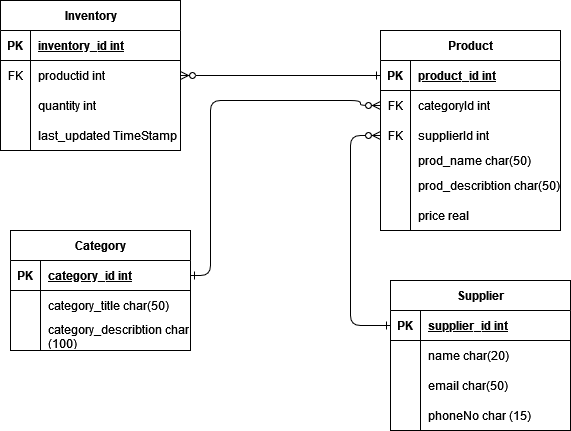

# Inventory Management System APIs

This document represetnts APIs for a basic inventory management system. These APIs can be used to perform various operations related to managing inventory, such as adding products, categories, updating quantities, and retrieving inventory information, and many other of the basic operations that could be done on such a system.

## Resource
The following resources are introduced in this system:
- `Product`: Represents the available products in the inventory. products have relation with categories and suppliers.
- `Category`: Represents different categories in which products are organized. Each product belongs to one category.
- `Supplier`: Represents the suppliers from whom the products are purchased. Products have relations with suppliers.
- `Inventory`: Represents the current stock/availability of each product. it have relations with products.

## How to Run the Application
To run the Java Spring Boot application, follow these steps:

1. Make sure you have Java Development Kit (JDK version 21 or higher) installed on your machine. 

2. Clone the repository or download the source code for the application.

3. Open a terminal or command prompt and navigate to the root directory of the application.

4. Build the application by running the following command:
    ```
    mvnw clean install
    ```

5. Once the build is successful, start the application by running the following command:
    ```
    mvnw spring-boot:run
    ```
6. The application will start and listen on a specific port (usually 8080). You can access the application by opening `http://localhost:8080`.

## ER Diagram

Here is the Entity-Relationship (ER) diagram for the inventory management system:

<div style="background-color: white;">

</div>


The diagram shows the relationships between the entities in the system, including products, categories, suppliers, and inventory. Each entity is represented by a rectangle, and the relationships between entities are represented by lines connecting them.
## Collection Resource
### Request and Response Formats
-  `All API requests and responses are in JSON format.`
### SwaggerHub documentation using OpenAPI 3.1.0 
[SwaggerHub documentation](https://app.swaggerhub.com/apis-docs/LUTFIQASIM2002_1/inventory_managment_system/1.0.0).


### Collection Resource (/products)
#### HTTP Requests for product entity

| Method | Endpoint| Description | HTTP Status Codes | Request Sample| Response Sample |
|--------|------------------|--------------------------------------|------------------------------------------------------------------------------------------------------|-----------------------------------------------------------------------------------------------------|-----------------------------------------------------------------------------------------------------|
| GET| /products| Get all products| `200 OK`: Successfully,retrieved the list of products<br>`500 Internal Server Error`: An error occurred while retrieving the products | N/A  | ```json [ { "id": "1", "categoryId": "1","supplierId": "1","prod_name": "Product 1", "prod_describtion": "description","price": 50 }, { "id": "2", "categoryId": "1","supplierId": "1","prod_name": "Product 2", "prod_describtion": "description 2","price": 100 } ] ``` |
| GET| /products/{id}| Get product with id= {id}| `200 OK`: Successfully retrieved the product<br>`404 Not found`: Product with given id not found <br> `500 Internal Server Error`: An error occurred while retrieving the products | N/A  | ```json  { "id": "1", "categoryId": "1","supplierId": "1","prod_name": "Product 1", "prod_describtion": "description","price": 50 }``` |
| POST   | /products | Create a new product | 201 Created: Successfully created the product<br>400 Bad Request: Invalid request body or missing required fields<br>500 Internal Server Error: An error occurred while creating the product | ```json { "name": "New Product", "categoryId": "1","supplierId": "1", "prod_describtion": "", "price": 20 } ```                                              | ```json { "id": "3", "name": "New Product", "categoryId": "1", "supplierId": "1", "prod_describtion": "", "price": 20 } ```                                    |
| PUT    | /products/{id}   | Update an existing product | 200 OK: Successfully updated the product<br>400 Bad Request: Invalid request body or missing required fields<br>404 Not Found: Product not found<br>500 Internal Server Error: An error occurred while updating the product | ```json { "name": "Updated Product", "UpdatedcategoryId": "2","updatedsupplierId": "1", "prod_describtion": "Updated", "price": 10 } ```    ```| N/A |
| PATCH  | /products/{id}   | Partially update an existing product  | 200 OK: Successfully updated the product<br>400 Bad Request: Invalid request body or missing required fields<br>404 Not Found: Product not found<br>500 Internal Server Error: An error occurred while updating the product | ```json { "price": 150 } ```                                                                      | N/A |
| DELETE | /products/{id}   | Delete an existing product            | 204 No Content: Successfully deleted the product<br>404 Not Found: Product not found<br>500 Internal Server Error: An error occurred while deleting the product | N/A| N/A |
---
### Collection Resource (/inventory)
#### HTTP Requests for inventory entity
| Method | Endpoint| Description                           | HTTP Status Codes                                                                                                                                                                                                              | Request Sample| Response Sample |
|--------|------------------|---------------------------------------|--------------------------------------------------------------------------------------------------------------------------------------------------------------------------------------------------------------------------------|-----------------------------------------------------------------------------------------------------|-----------------------------------------------------------------------------------------------------|
| GET| /inventory| Get all inventory                     | `200 OK`: Successfully,retrieved the list of inventory<br>`500 Internal Server Error`: An error occurred while retrieving the inventory                                                                                        | N/A  | ```json [ { "id": "1", "inventory_id": "1","productId": "1","quantity": 50, "last_updated": "2013-01-19 03:14:07" }, { "id": "2", "inventory_id": "2","productId": "2","quantity": 100, "last_updated": "2023-01-19 03:14:07" } ] ``` |
| GET| /inventory/{id}| Get inventory with id= {id}           | `200 OK`: Successfully retrieved the inventory<br> `404 Not found`: inventory with given id not found <br>`500 Internal Server Error`: An error occurred while retrieving the inventory                                        | N/A  | ```json  { "id": "1", "inventory_id": "1","productId": "1","quantity": 50, "last_updated": "2013-01-19 03:14:07" }``` |
| POST   | /inventory | Create a new inventory                | 201 Created: Successfully created the inventory<br>400 Bad Request: Invalid request body or missing required fields<br>500 Internal Server Error: An error occurred while creating the inventory                                | ```json { "inventory_id": "1","productId": "1","quantity": 50, "last_updated": "2013-01-19 03:14:07" } ``` | ```json { "id": "3", "inventory_id": "1","productId": "1","quantity": 50, "last_updated": "2013-01-19 03:14:07" } ```|
| PUT    | /inventory/{id}   | Update an existing inventory           | 200 OK: Successfully updated the inventory<br>400 Bad Request: Invalid request body or missing required fields<br>404 Not Found: inventory not found<br>500 Internal Server Error: An error occurred while updating the inventory | ```json { "inventory_id": "1","productId": "1","quantity": 50, "last_updated": "2013-01-19 03:14:07" } ```| N/A |
| PATCH  | /inventory/{id}   | Partially update an existing inventory | 200 OK: Successfully updated the inventory<br>400 Bad Request: Invalid request body or missing required fields<br>404 Not Found: inventory not found<br>500 Internal Server Error: An error occurred while updating the inventory | ```json { "quantity": 15 } ``` | N/A |
| DELETE | /inventory/{id}   | Delete an existing inventory           | 204 No Content: Successfully deleted the inventory<br>404 Not Found: inventory not found<br>500 Internal Server Error: An error occurred while deleting the inventory                                                             | N/A| N/A |
---
### Collection Resource (/categories)
#### HTTP Requests for category entity

| Method | Endpoint| Description | HTTP Status Codes | Request Sample| Response Sample |
|--------|------------------|--------------------------------------|------------------------------------------------------------------------------------------------------|-----------------------------------------------------------------------------------------------------|-----------------------------------------------------------------------------------------------------|
| GET| /categories| Get all categories| `200 OK`: Successfully,retrieved the list of categories<br>`500 Internal Server Error`: An error occurred while retrieving the categories | N/A  | ```json [ { "id": "1", "title": "Electronics", "description": "Electronics category description" }, { "id": "2", "title": "Clothing", "description": "Clothing category description" } ] ```  |
| GET| /categories/{id}|  Get category with id= {id}| `200 OK`: Successfully retrieved the category<br>`404 Not found`: categoriy with given id not found <br>`500 Internal Server Error`: An error occurred while retrieving the category | N/A  |  ```json  { "id": "1", "title": "Electronics", "description": "Electronics category description" }``` |
| POST   | /categories |  Create a new category  | 201 Created: Successfully created the category<br>`400 Bad Request`: Invalid request body or missing required fields<br>500 Internal Server Error: An error occurred while creating the category | ```json { "title": "New Category", "description": "New category description" } ``` | ```json { "id": "3", "title": "New Category", "description": "New category description" } ```|
| PUT    | /categories/{id}   | Update an existing category  | `200 OK`: Successfully updated the category<br>`400 Bad Request`: Invalid request body or missing required fields<br>`404 Not Found`: Category not found<br>`500 Internal Server Error`: An error occurred while updating the category |```json { "title": "Updated Category", "description": "Updated category description" } ```| N/A |
| PATCH  | /categories/{id}  | Partially update an existing category   | `200 OK`:Successfully updated the category<br>`400 Bad Request`: Invalid request body or missing required fields<br>`404 Not Found`: Category not found<br>`500 Internal Server Error`: An error occurred while updating the category | ```json { "description": "Updated category description" } ```  | N/A |
| DELETE | /categories/{id}   | Delete an existing category| 204 No Content: Successfully deleted the category<br>`404 Not Found`: category not found<br>`500 Internal Server Error`: An error occurred while deleting the category | N/A| N/A |
---

### Collection Resource (/suppliers)
#### HTTP Requests for supplier entity

| Method | Endpoint| Description | HTTP Status Codes | Request Sample| Response Sample |
|--------|------------------|--------------------------------------|------------------------------------------------------------------------------------------------------|-----------------------------------------------------------------------------------------------------|-----------------------------------------------------------------------------------------------------|
| GET| /suppliers| Get all suppliers| `200 OK`: Successfully retrieved the list of suppliers<br>`500 InternalServer Error`: An error occurred while retrieving the suppliers | N/A  | ```json [ { "supplier_id": "1", "name": "Supplier 1", "email": "supplier1@example.com", "phoneNo": "1234567890" }, { "supplier_id": "2", "name": "Supplier 2", "email": "supplier2@example.com", "phoneNo": "9876543210" } ] ``` |
| GET| /suppliers/{id}| Get supplier with id= {id}| `200 OK`: Successfully retrieved the supplier<br>`404 Not found`: Supplier with given id not found <br>`500 Internal Server Error`: An error occurred while retrieving the supplier | N/A  | ```json  { "supplier_id": "1", "name": "Supplier 1", "email": "supplier1@example.com", "phoneNo": "1234567890" }``` |
| POST   | /suppliers | Create a new supplier | 201 Created: Successfully created the supplier<br>400 Bad Request: Invalid request body or missing required fields<br>500 Internal Server Error: An error occurred while creating the supplier | ```json { "name": "New Supplier", "email": "newsupplier@example.com", "phoneNo": "9876543210" } ``` | ```json { "supplier_id": "3", "name": "New Supplier", "email": "newsupplier@example.com", "phoneNo": "9876543210" } ```|
| PUT    | /suppliers/{id}   | Update an existing supplier | 200 OK: Successfully updated the supplier<br>400 Bad Request: Invalid request body or missing required fields<br>404 Not Found: Supplier not found<br>500 Internal Server Error: An error occurred while updating the supplier | ```json { "name": "Updated Supplier", "email": "updatedsupplier@example.com", "phoneNo": "1234567890" } ```| N/A |
| PATCH  | /suppliers/{id}   | Partially update an existing supplier  | 200 OK: Successfully updated the supplier<br>400 Bad Request: Invalid request body or missing required fields<br>404 Not Found: Supplier not found<br>500 Internal Server Error: An error occurred while updating the supplier | ```json { "email": "updatedsupplier@example.com" } ``` | N/A |
| DELETE | /suppliers/{id}   | Delete an existing supplier| 204 No Content: Successfully deleted the supplier<br>404 Not Found: Supplier not found<br>500 Internal Server Error: An error occurred while deleting the supplier | N/A| N/A |
---

### Contribution
This project is developed as part of the Web Services class at Birzeit University, taught by Dr. Mohammad Kharmah.
